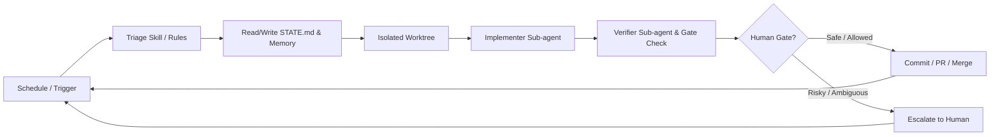

# 🔄 รู้จัก Loop Engineering — ยุคใหม่ของการทำงานร่วมกับ AI Coding Agents

> *"You shouldn’t be prompting coding agents anymore. You should be designing loops that prompt your agents."*  
> — **Peter Steinberger**

> *"I don’t prompt Claude anymore. I have loops running that prompt Claude and figuring out what to do. My job is to write loops."*  
> — **Boris Cherny** (Head of Claude Code at Anthropic)

ยุคของการนั่งพิมพ์ Prompt ทีละคำสั่งเพื่อสั่งให้ AI ช่วยเขียนโค้ดกำลังค่อยๆ ผ่านไป บทบาทใหม่ของนักพัฒนาคือการเปลี่ยนจาก **"Prompt Engineer"** มาเป็น **"Loop Engineer"** — ผู้เชี่ยวชาญการออกแบบระบบควบคุม (Control System & Orchestration Layer) ที่สั่งการและควบคุม AI Coding Agent ให้ทำงานวนลูปได้อย่างปลอดภัย รวดเร็ว และเป็นอัตโนมัติ

Repository **[cobusgreyling/loop-engineering](https://github.com/cobusgreyling/loop-engineering)** เป็นแหล่งรวบรวม **Practical Patterns, Starters และ CLI Tools** ที่ได้รับแรงบันดาลใจจาก Addy Osmani และ Boris Cherny เพื่อช่วยให้เราเริ่มต้นสร้าง AI Agent Loops ในโปรเจกต์จริงได้ทันที

---

## 💡 สรุปแนวคิดหลักของ Loop Engineering

**Loop Engineering** คือการออกแบบสถาปัตยกรรมและ workflow อัตโนมัติรอบตัว AI Agent โดยให้ Agent สามารถ:
1. **อ่านสถานะ (Read Context & State)** จากคลังโค้ดหรือระบบบันทึกสถานะ
2. **ประมวลผลและแก้ไขโค้ด (Implement Changes)** ในสภาพแวดล้อมที่แยกเป็นอิสระ (Isolated Worktree)
3. **ตรวจสอบความถูกต้อง (Verify & Gate Check)** ด้วยการรัน Tests และผ่าน Safety Controls
4. **บันทึกความก้าวหน้า (Update Memory & State)** เพื่อเตรียมพร้อมสำหรับการรันรอบถัดไป



---

## 🧱 องค์ประกอบสำคัญ 5 ประการ + Memory (The 5 Building Blocks + Memory)

การสร้าง Loop ที่มีประสิทธิภาพจำเป็นต้องมีองค์ประกอบ 6 ส่วนหลักดังนี้:

| องค์ประกอบ | หน้าที่และความสำคัญ |
|---|---|
| **1. Schedule / Automation** | ตัวจุดชนวน (Trigger) เช่น Cron Schedule, GitHub Actions, หรือ Git Hooks สำหรับการเรียกใช้ Loop ตามรอบเวลาหรือเหตุการณ์ |
| **2. Triage Skill / Rules** | กฎเกณฑ์ในการประเมินและคัดกรองงาน เพื่อตัดสินใจว่าควรทำอะไรก่อน-หลัง และขอบเขตการแก้ไขอยู่ตรงไหน |
| **3. State & Memory Management** | ระบบบันทึกความก้าวหน้าลงในไฟล์ (เช่น `STATE.md`, `LOOP.md`) ป้องกันไม่ให้ Agent หลงลืม context เมื่อเริ่มรันรอบใหม่ |
| **4. Execution Environment** | สภาพแวดล้อมการทำงานที่ปลอดภัย แยกต่างหากจาก main branch (เช่น Git Worktree หรือ Temporary Branch) |
| **5. Implementer & Verifier Agents** | การแบ่งบทบาทแยกระหว่าง Agent ตัวเขียนโค้ด (Implementer) กับ Agent/Script ตัวตรวจสอบความถูกต้อง (Verifier) |
| **🛡️ Human Gate & Safety Policies** | นโยบายความปลอดภัยและจุดสกัดให้มนุษย์เข้ามาตรวจสอบ (Human-in-the-loop) ในกรณีที่เป็นงานเสี่ยงสูงหรือมีความซับซ้อน |

---

## 🛠️ เครื่องมือ CLI ใน Ecosystem (`@cobusgreyling/*`)

ใน repository มีการแจกจ่าย CLI tools ผ่าน npm เพื่อช่วยให้เราสร้าง Audit และวัดระดับความพร้อมของโปรเจกต์ได้ง่ายๆ:

### 1. `loop-init`
เครื่องมือสำหรับเริ่มต้นสร้างโครงสร้างไฟล์พื้นฐานของ Loop (เช่น `STATE.md`, `LOOP.md`, budget configs) พร้อมคำนวณคะแนน **Loop Ready Score**

```bash
npx @cobusgreyling/loop-init . --pattern daily-triage --tool claude
```

### 2. `loop-audit`
เครื่องมือตรวจสอบโปรเจกต์ปัจจุบันว่ามีองค์ประกอบของ Loop ครบถ้วนหรือไม่ พร้อมให้คำแนะนำในการปรับปรุง และสามารถออก **Loop Ready Badge** ไปติดบน README ได้

```bash
npx @cobusgreyling/loop-audit . --suggest
```

### 3. `loop-cost`
เครื่องมือสำหรับประเมินและคาดการณ์ Token Cost / Expense จากระดับความซับซ้อนและความถี่ของการรัน Loop เพื่อป้องกันปัญหางบประมาณบานปลาย

```bash
npx @cobusgreyling/loop-cost --pattern daily-triage --level L1
```

---

## 🎯 รูปแบบ Loop ยอดนิยม (Core Patterns)

Repository นี้ได้เตรียม Starter Template ไว้สำหรับ 7 Patterns หลักที่พบบ่อยในงานซอฟต์แวร์:

1. **Daily Triage**: สแกนประเด็นปัญหา ตรวจสอบสถานะ CI/CD และสรุปรายงานประจำวันลง `STATE.md`
2. **PR Babysitter**: คอยเฝ้า Pull Request, ตรวจสอบผล CI Test, ช่วยเสนอ code suggestion หรือแก้ข้อผิดพลาดเล็กๆ น้อยๆ
3. **CI Sweeper**: สแกนหา build fail หรือ flaky test แล้วทดลองหาสาเหตุและสร้าง PR แก้ไขให้อัตโนมัติ
4. **Dependency Sweeper**: ตรวจสอบแพ็คเกจที่ล้าสมัย รันการอัปเดตและรัน Test เพื่อยืนยันว่าไม่มี breaking changes
5. **Changelog Drafter**: รวบรวม commit และ PR ล่าสุดมาเรียบเรียงร่างเป็น Release Notes / Changelog
6. **Post-Merge Cleanup**: สแกนกิ่งไม้ (Branches) ที่ merge แล้ว หรือลบไฟล์ชั่วคราวหลังจบ release
7. **Issue Triage**: คัดกรองและใส่ Label จัดกลุ่ม GitHub Issues ใหม่ตามประเภทและ priority

---

## 📶 ระดับความเป็นอิสระของการทำงาน (Autonomy Levels)

เพื่อความปลอดภัยในการนำไปใช้งาน cobusgreyling เสนอแนวทางการไต่ระดับความเป็นอิสระออกเป็น 3 เลเวล:

- **L1 — Report-only**: Agent สแกนและสรุปรายงานปัญหา/คำแนะนำลงไฟล์ แต่**ไม่มีสิทธิ์แก้ไขโค้ด**
- **L2 — Assisted Fixes**: Agent สามารถแก้ไขโค้ดบน branch ใหม่และสร้าง PR เพื่อเสนอวิธีแก้ แต่**ต้องให้คนมาตรวจและกด Approve/Merge**
- **L3 — Unattended Execution**: Agent ทำงาน แก้ไขโค้ด และอนุมัติการ Merge ด้วยตัวเองโดยอัตโนมัติ ภายใต้เงื่อนไข safety policy ที่กำหนดไว้อย่างเข้มงวด

---

## 🚀 วิธีเริ่มต้นใช้งาน Step-by-Step

หากต้องการนำ Loop Engineering มาประยุกต์ใช้กับโปรเจกต์ของคุณ สามารถทำตามขั้นตอนต่อไปนี้:

### Step 1: เริ่มต้นโครงสร้าง Loop ในโปรเจกต์ด้วย `loop-init`
เปิด terminal ในโฟลเดอร์โปรเจกต์ของคุณแล้วรันคำสั่ง:

```bash
npx @cobusgreyling/loop-init . --pattern daily-triage --tool claude
```

*(สามารถเปลี่ยน `--tool` เป็น `grok`, `codex`, หรือ `opencode` ตาม AI Agent ที่คุณใช้)*

### Step 2: ประเมินความพร้อมของโปรเจกต์ด้วย `loop-audit`
รันคำสั่งตรวจสอบเพื่อดูว่าโปรเจกต์ของคุณมีคะแนนความพร้อม (Loop Ready Score) เท่าใด และมีคำแนะนำเรื่องใดบ้าง:

```bash
npx @cobusgreyling/loop-audit . --suggest
```

### Step 3: คาดการณ์ Token Cost ด้วย `loop-cost`
ก่อนตั้งค่าให้รันอัตโนมัติ ควรประเมินงบประมาณ token ที่ต้องใช้:

```bash
npx @cobusgreyling/loop-cost --pattern daily-triage --level L1
```

### Step 4: กำหนดรายละเอียดความต้องการใน `STATE.md` และ `LOOP.md`
- **`STATE.md`**: ใช้สำหรับบันทึกงานที่ค้างอยู่ (Pending Tasks), งานที่สำเร็จแล้ว (Done), และคำเตือนต่าง ๆ
- **`LOOP.md`**: ใช้สำหรับกำหนดขั้นตอนการทำงาน (Instruction Steps) ให้ Agent รู้ว่าเมื่อรันในแต่ละรอบต้องทำอะไรบ้าง

### Step 5: เริ่มต้นรันจาก L1 (Report-Only)
ในสัปดาห์แรก แนะนำให้ตั้งค่าให้ Agent ทำหน้าที่เพียงรวบรวมข้อมูลและรายงานผลลงใน `STATE.md` โดยยังไม่ต้องแก้โค้ดจริง เมื่อมั่นใจในคุณภาพคำตอบของ Agent แล้วจึงค่อยขยับไปสร้าง PR ในระดับ L2 ต่อไป

---

## ⚡ การปรับใช้ Loop Engineering บน Antigravity IDE & CLI

หากคุณใช้งาน **Antigravity IDE** และ **Antigravity CLI** การนำ Loop Engineering มาประยุกต์ใช้ในโปรเจกต์จริงจะราบรื่นและมีประสิทธิภาพสูงมาก เพราะ Antigravity มีระบบ **Customizations, Skills, Rules และ Automation Scheduling** ในตัว

### 📂 โครงสร้างไฟล์ในโปรเจกต์ Antigravity

| ไฟล์ | ตำแหน่ง | หน้าที่ใน Antigravity Loop |
|---|---|---|
| **`LOOP.md`** | Root | ระบุคำสั่งและขั้นตอนการทำงานวนลูปของ Antigravity Agent ในแต่ละรอบ |
| **`STATE.md`** | Root | บันทึกสถานะล่าสุด สุขภาพของ Build, บทความใหม่ และรายการงานค้าง (Pending Tasks) |
| **`AGENTS.md`** | `.agents/AGENTS.md` | กำหนดกฎเหล็กและขอบเขตทางเทคนิคของโปรเจกต์ที่ Antigravity ต้องปฏิบัติตาม |
| **`SKILL.md`** | `.agents/skills/portfolio-triage/` | สร้าง Custom Agent Skill สำหรับสั่งให้ Antigravity ตรวจสอบคลังโค้ดเฉพาะทาง |

---

### 🕹️ คำสั่งการใช้งานผ่าน Antigravity

#### 1. การรัน Loop ตามเป้าหมายด้วย Slash Command `/goal`
คุณสามารถใช้คำสั่ง `/goal` ใน Antigravity IDE เพื่อสั่งให้ Agent ดำเนินการตาม Loop จนสำเร็จ:
```text
/goal รัน Loop ตามคำสั่งใน LOOP.md ตรวจสอบบทความใหม่ สุขภาพของ Build แล้วอัปเดต STATE.md
```

#### 2. การตั้งเวลารันอัตโนมัติด้วย Slash Command `/schedule`
หากต้องการตั้งรอบการตรวจเช็คอัตโนมัติ (เช่น สแกนประจำวัน):
```text
/schedule รัน portfolio-triage skill ตรวจสอบ build และอัปเดต STATE.md ทุกๆ 24 ชั่วโมง
```

#### 3. การรันผ่าน Antigravity CLI
สามารถสั่งงานผ่าน Terminal ได้โดยตรง:
```bash
antigravity goal "Run daily portfolio triage loop and update STATE.md"
```

---

## ⚠️ ข้อควรระวังในการใช้งาน (Caveats & Best Practices)

- 💸 **ระวัง Token Cost**: การรัน Loop แบบต่อเนื่อง โดยเฉพาะหากมีการใช้งาน sub-agents หลายตัว อาจทำให้การบริโภค Token สูงขึ้นอย่างรวดเร็ว
- 🔍 **คุณยังคงเป็นผู้รับผิดชอบหลัก**: Agent สามารถทำผิดพลาดได้แบบอัตโนมัติพอๆ กับทำงานได้ถูกต้องแบบอัตโนมัติ การตีกรอบการทดสอบ (Automated Verification) จึงสำคัญมาก
- 📈 **เริ่มจากเล็กไปใหญ่**: อย่าเพิ่งกระโดดไปรัน L3 อัตโนมัติเต็มรูปแบบ ให้เริ่มสร้างความเชื่อมั่นจาก L1 สรุปรายงานก่อนเสมอ

---

## 📌 สรุป

**Loop Engineering** ไม่ใช่การนำ AI มาแทนที่นักพัฒนา แต่เป็นกลยุทธ์การยกระดับนักพัฒนาให้กลายเป็น **System Designer** ผู้กำกับดูแลระบบ เพื่อให้ AI Agent สามารถทำงานแทนเราได้อย่างเป็นระเบียบ ปลอดภัย และสร้างคุณค่าได้จริงในระยะยาว

สามารถเข้าไปศึกษาโค้ด สถาปัตยกรรม และตัวอย่างทั้งหมดได้ที่ [GitHub: cobusgreyling/loop-engineering](https://github.com/cobusgreyling/loop-engineering)
